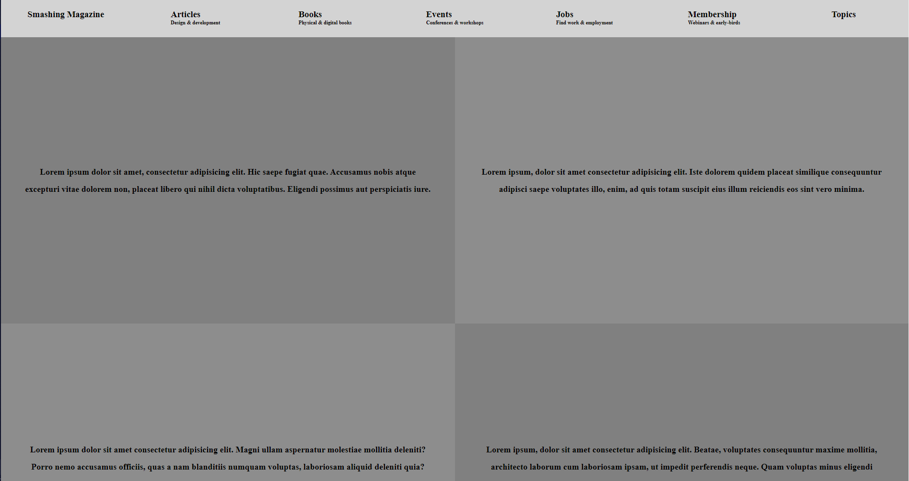

# Design Teardown

## [Collaborative Project]

~ This project consists of building a heatmap of the [Smashing magazine](https://www.smashingmagazine.com/) website.

You can find the original project specification [here](https://www.theodinproject.com/courses/html5-and-css3/lessons/design-teardown)

|Source Page|Clone page Heatmap|
|:---:|:---:|
|||

## Tools Used

- HTML
- CSS
- Flex & Grids
- FontAwsome v5.11.2
- MarkDown Syntax

## Work Done

- [x] Create header Section
- [x] Create first-section Div
- [x] Create Latest-posts Section
- [x] Crete community Section
- [x] Create the green Section
- [x] Create person-of-the-week Section
- [x] Create other-persons Section
- [x] Create center-section Section
- [x] Create curated Section
- [x] Create smashing-newsletter Section
- [x] Create footer Section
- [x] Use Semantic HTML
- [x] Use Flex and Grids
- [x] Check CSS with stylelint
- [x] Check html with W3C validator
- [x] Validate Readme file with markdown lint

## How to Install and use

- clone the repository `git clone https://github.com/ChristianOtieno/smashing-magazine-clone.git`
- open command prompt in `smashing-magazine-clone` folder
- run the application using open live server functionality.

LInk to live demo [here](https://christianotieno.github.io/smashing-magazine-clone/.)

## Authors

### 1. Roodz Fernando's social links

- Roodz Fernando: [@RoodzFernando](https://github.com/RoodzFernando)
- Twitter: [@RoodzFernando](https://twitter.com/RoodzFernando)
- Linkedin: [Roodz Fernando](https://www.linkedin.com/in/roodz-fernando-fleurant/)

### 2. Christian Otieno's social links

- Github: [@christianotieno](https://github.com/christianotieno)
- Twitter: [@iamchrisotieno](https://twitter.com/iamchrisotieno)
- Linkedin: [Christian Otieno](https://www.linkedin.com/in/christianotieno/)